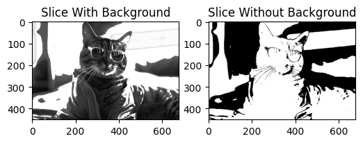

**CLA-6**

**#Aim**

To perform intensity-level slicing on a grayscale image using a specified intensity range, in order to highlight the pixels within that range and observe the effect both with and without retaining the background.

**#Description**

Intensity-level slicing is an image enhancement technique used to emphasize a specific range of intensity values in an image. In this experiment, the grayscale image is processed using an intensity range of 100 to 200.

The pixels whose intensity values fall within this range are highlighted. Two results are produced:

Slice With Background: The selected intensity range is highlighted while the remaining background information is retained.

Slice Without Background: The selected intensity range is highlighted while pixels outside the specified range are suppressed.

The original image and the resulting sliced images are displayed for visual comparison. This technique is useful for emphasizing particular objects or regions whose intensity values fall within a desired range.

**#Conclusion**

Intensity-level slicing was successfully applied to the grayscale image using the intensity range 100–200. The selected intensity levels were highlighted, producing two versions of the image: one retaining the background and another suppressing it. The experiment demonstrates how intensity-level slicing can be used to enhance and isolate specific regions of an image based on their pixel intensity values.
